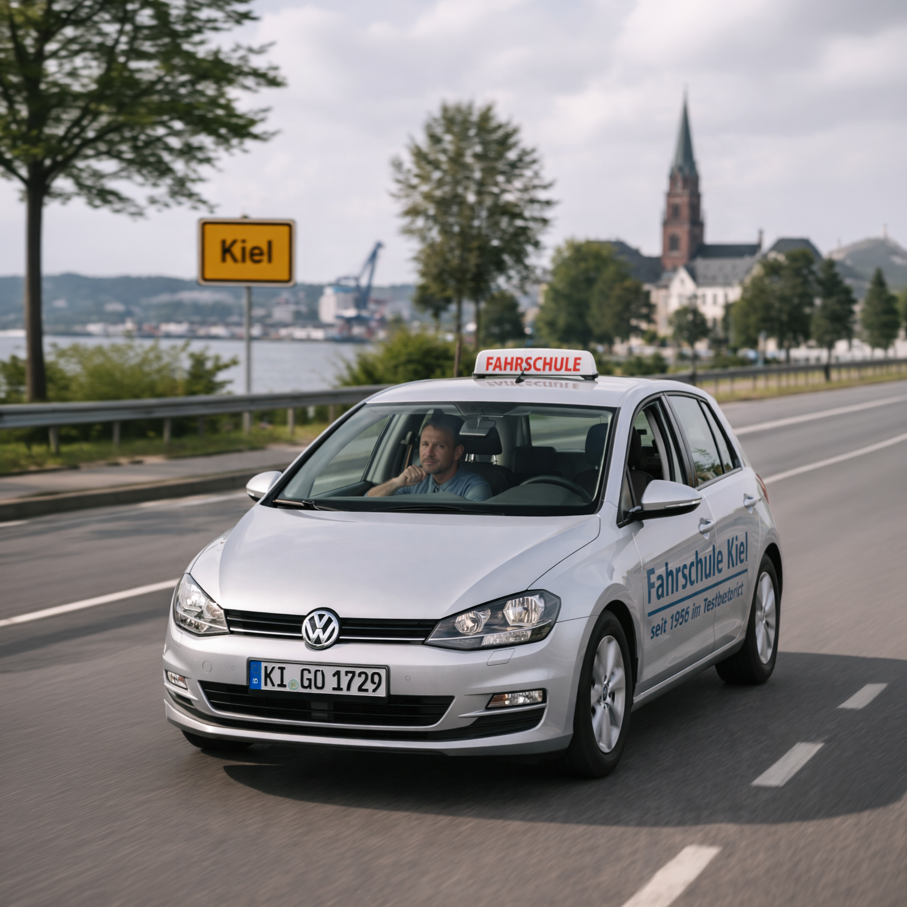
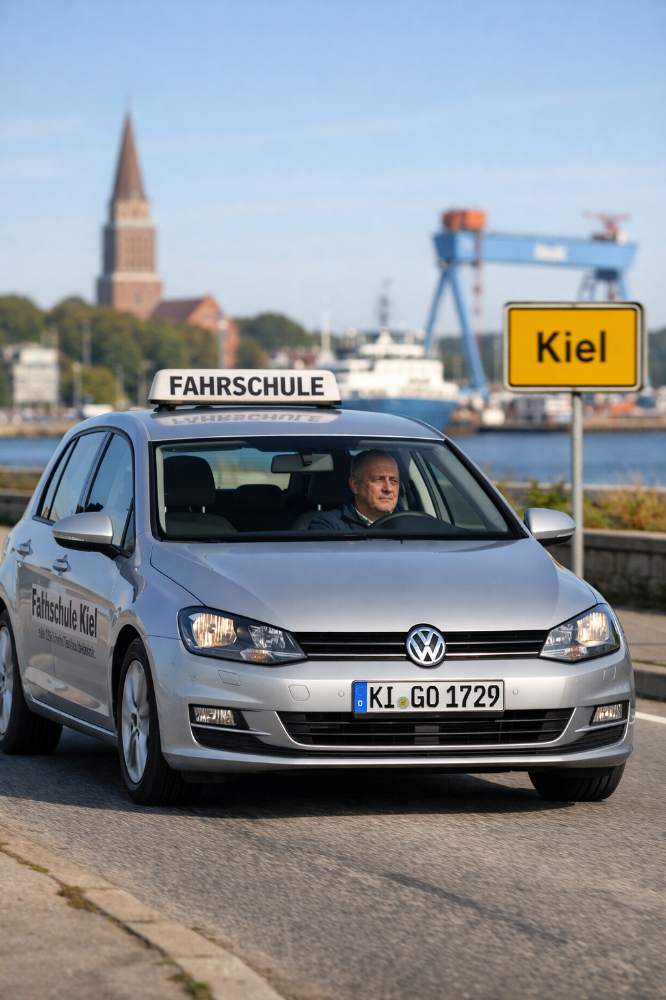
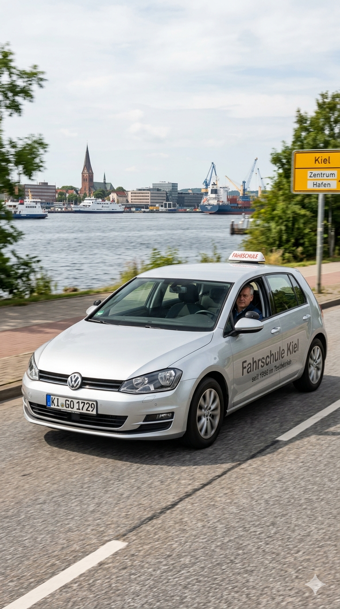
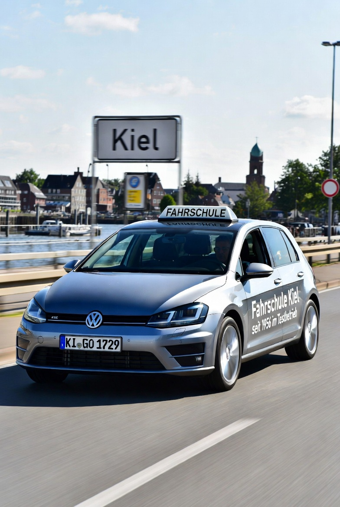

# The Self-Driving Car No AI Could Imagine

For my April fools' article about AI vehicles ([original in German](https://chrwittm.github.io/posts/2026-04-01-KI-Fahrzeuge/) / [translated to English](https://chrwittm.github.io/posts/2026-04-01-KI-vehicles/)), I needed a title image that told the whole story at a glance: A self-driving car training in driving school in Kiel (with a KI-license plate). The key detail which turned out to be challenging was that the driver's seat had to be empty.

No matter what I tried, no AI could generate it. I rewrote the prompt multiple times, made the instructions more specific, emphasized the key detail in ALL CAPS, and eventually had a language model rewrite the whole thing into a very precise scene description. Yet every attempt came back with the same result: someone was sitting in the driver's seat.

After what felt like too many failed attempts with ChatGPT, I realized this was more than a prompt engineering problem. It was a genuine edge case worth exploring properly. So I took the final prompt and gave it to a few different image generation models. Let's see how they did.



## The Experiment

Here is the prompt I gave to ChatGPT, Gemini, and Grok:

```text
Please generate the following image in portrait format:

A highly realistic photo of a German driving school car (silver Volkswagen Golf) driving on a road in Kiel, Germany. The car has a small, standard German driving school roof sign ("FAHRSCHULE"), similar in size to a taxi sign, not oversized.

The car is clearly in motion, captured from a front three-quarter angle. The license plate reads "KI-GO 1729" in authentic German style. On the side of the car is subtle, realistic text: "Fahrschule Kiel" and smaller text "seit 1956 im Testbetrieb".

**The key detail: the driver's seat is completely empty and clearly visible through the windshield. A middle-aged driving instructor sits in the front passenger seat, looking forward calmly, not touching the steering wheel.**

The scene is set in Kiel with a realistic northern German atmosphere: nice sunny day, a visible "Kiel" town sign, harbor elements in the background such as water, a ship or crane, and a distant church tower.

No other cars in the scene. No futuristic elements, no overlays.

The style must be fully photorealistic, like a real photograph, natural lighting, shallow depth of field, high detail, no artificial or AI-generated look. Vertical composition.
```

Here are the one-shot results I got from each model, without any further prompting or adjustments.

**ChatGPT:**



**Gemini:**



**Grok:**



All three models handled the straightforward parts well: the VW Golf, the Kiel harbor background, the license plate, the side text. ChatGPT produced the most photorealistic result overall, Gemini created the best background for my taste and a realistic "Fahrschule" sign, and Grok rendered the best car-in-motion with nice dynamics.

But all three failed to generate the one thing that actually mattered: the empty driver's seat. ChatGPT placed a person visibly in the driver's seat. Gemini also generated a driver. Grok rendered very dark car interiors, but there is clearly a person in the driver's seat. Why did all three models do this, even though the prompt explicitly said the driver's seat should be empty?

## Why This Happens

The straightforward explanation is this: think about how often you have seen a self-driving car in real life — probably never. This also means there are almost no (or only very few) photographs of self-driving cars around, hence there is no training data for AI. These models have never seen what I was asking them to generate.

What they have seen, across billions of images, is the opposite: in every car that is on the road, there is a person in the driver's seat. That pattern is not a programmed rule. It is baked into the model through sheer statistical weight. Ask it for something that violates that pattern and it has nothing to fall back on.

### Interpolation vs. extrapolation

Jeremy Howard has made this point repeatedly. For example, in the [Machine Learning Street Talk](https://www.youtube.com/watch?v=dHBEQ-Ryo24&t=1193s), he points out that models are not good at extrapolation outside the training distribution. This is part of a discussion about creativity, where Jeremy argues that models can be extremely creative, but only when they can interpolate within the data they have been trained on. When moving out of their training distribution, models can go "from being incredibly clever to like worse than stupid, like not understanding the most basic fundamental premises about how the world works." The interpolation within their training data can look like understanding. The extrapolation beyond it reveals that it isn't.

Our empty driver's seat is exactly that extrapolation. Every individual element in the prompt is well within what these models know: a VW Golf, a driving school sign, Kiel harbor, a person in a passenger seat. The specific combination (a car in motion with an explicitly empty driver's seat) sits outside what the model has learned. Therefore, it defaults to the most probable pattern it knows (a person in the driver's seat).

The metaphor of the [stochastic parrot](https://en.wikipedia.org/wiki/Stochastic_parrot), even if it is typically used in the context of language models, beautifully captures what is happening. The models produce statistically plausible output without actually understanding what they should generate or that they are generating it incorrectly. That is where reasoning would help.

### Image generation models do not reason

If we pass the generated image back to the language model and ask it to evaluate the result, it recognizes the mismatch. Also, one important realization is that the language model and the image generation model are different in all three products. Not only do they have different architectures, there is an important difference in their capabilities: their ability to reason.

Modern language models can work through a problem before committing to an answer. They generate a chain of thought, catch inconsistencies, and revise. A human artist given this prompt would do something similar: "Empty driver's seat, that's unusual. Let me make sure I get that right before I start." That kind of deliberate self-checking is what allows them to handle logically unusual requests.

Image generation models have no equivalent (yet?). Generation begins immediately, guided by statistical patterns, with no step where the model checks whether the output actually satisfies the constraints in the prompt. And here is a concrete way to see this difference: giving a reasoning language model more thinking time improves its performance on hard logical problems. Giving a diffusion model more generation steps produces a sharper, more detailed image. The person in the driver's seat does not move. More compute improves the rendering quality. It does not improve the model's understanding of what it is being asked to generate.

Routing the prompt through a language model first, asking it to produce an expanded, more precise scene description, therefore only has limited impact on the result, because the refined prompt cannot influence the image generation process or solve the image model's inability to execute an unusual scene once generation begins.

## Conclusion

This is a surprising edge case. The experiment shows that this is not just a glitch in one of the models, but a more structural current limitation of image generation models. They struggle with scenes that are logically possible but statistically unprecedented in their training data — if, and this is important, there is an overwhelming pattern in the training data which contradicts the requested scene.

In the future, I will certainly run the prompt again as a personal mini-benchmark, something like [the pelican riding a bicycle](https://simonwillison.net/2024/Oct/25/pelicans-on-a-bicycle/) from Simon Willison. Improvements can come either from improved model capabilities or through shifting realities in the training data. Once there are enough self-driving cars on the road, the pattern of an empty driver's seat will no longer be out of distribution.

## PS: How the Final Image Was Actually Made

One final question remains: how did I get the title image for this post, which shows exactly the scene I described in the prompt?

I took a different route. I generated a version of the car with nobody inside — no trouble with that. Afterwards I used Photoshop with Adobe Firefly to add the instructor in the passenger seat.

## PPS: A bit of irony

Self-driving cars are arguably the most visible real-world AI use case we will see at scale in the coming years. And yet the AI models we have today cannot even picture one. They keep looking back at how things always were, and they cannot imagine how things might be. It almost feels like the models are stuck in the past.