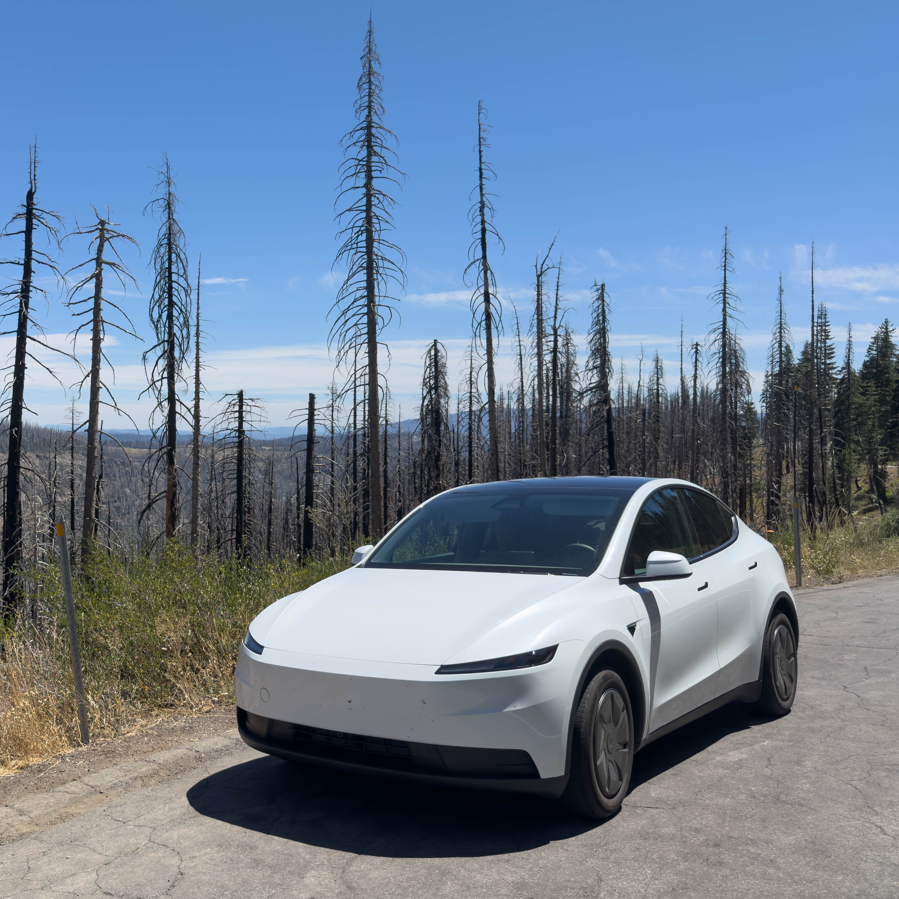

Self-driving cars have been just around the corner for more than a decade, but
the timelines kept slipping. Nonetheless, there are now places where autonomous
vehicles really do exist and where self-driving can be experienced firsthand.
In the United States, almost all Tesla owners can use
[Full Self-Driving (Supervised)](https://www.tesla.com/support/fsd) (FSD). In
selected cities, passengers can also ride in robotaxis from
[Waymo](https://waymo.com/rides/) and
[Tesla](https://www.tesla.com/support/robotaxi). But how good is the technology
really? Is self-driving finally around the corner, or is it still a decade
away?

When my wife and I planned a two-week vacation in California, the opportunity
was too good to miss. I rented a recent Model Y with FSD (version 14.3.6) through
[Turo](https://turo.com/), and we also took two Waymo rides in San Francisco.
This post summarizes my personal impressions after roughly 1,600 miles of city
traffic, freeways, mountain roads, nighttime driving, construction zones, and
even a dirt road.

{.lightbox fig-alt="Our Tesla Model Y parked in Lassen Volcanic National Park" width="50%" fig-align="center"}

## Long story short

Long story short: I did not have a single safety-critical intervention. After
the trip, I am convinced that the essential driving task is largely solved. FSD
drove remarkably well, and I believe it made fewer mistakes than I would have
made myself.

Nonetheless, I did take over, but only to park the car, adjust the route, avoid an
uncomfortable pothole, or simply pull over for a photograph in a national park.
FSD did almost all of the driving, but that does not mean the autonomous car is
solved.

Once the car can drive, the goalposts move: Can it park where I want? Can it
question an unhelpful route? Does it understand why I want to slow down or pull
over? Essentially, can it behave like a chauffeur? Just as ChatGPT creates a
complete product experience around the GPT model with chat, web search, memory,
and more, an autonomous car product is more than an AI model that can drive a
car.

That distinction only became clear to me during the trip. So let me take you
along for the ride, starting with my first few minutes with FSD at San Francisco
International Airport.

## Meeting FSD at San Francisco International Airport

After picking up the Model Y in a parking garage at San Francisco International
Airport, I enabled FSD immediately. I was excited, but also a little overwhelmed
by driving at an unfamiliar airport, checking whether the route on the screen
matched the signs around me, and monitoring FSD at the same time.

The car drove out of the parking garage and through the busy arrivals area. In
the standard driving profile, it felt a little too sporty for my taste and my
state of mind at that moment, so I took over.

An intervention after only a few hundred meters was a rough start. In
retrospect, however, I disengaged mainly because I did not trust the car yet and
did not know the FSD product well enough. Switching to Sloth mode, the slowest
speed profile, would have made the car drive more to my taste. Still, I would
prefer FSD to behave more defensively in an arrivals area in future releases,
regardless of the speed profile.

## Driving to the Golden Gate Bridge

Once we had cleared the arrivals area, I engaged FSD again. The car confidently
joined US 101 and continued via I-380 and I-280 toward the Golden Gate Bridge
and the Battery Spencer viewpoint.

My confidence grew with every mile as the car cruised the freeways, handled
city traffic, and navigated the small, winding roads in the [Marin
Headlands](https://www.nps.gov/goga/marin-headlands.htm). Every clean lane
change, nicely executed turn, and well-judged merge helped. At one point, the
car left generous space for a cyclist. Very quickly, I started to feel like a
passenger in the driver's seat.

By the end of that first day, despite the initial hiccup, my expectation had
largely been confirmed: FSD was extremely good at driving. But parking was a
challenge.

At Battery Spencer, I parked manually because I spotted a good space before we
reached the destination pin. At Point Bonita Lighthouse, FSD did not recognize
an available parking spot. At our final destination, it tried to park in the
wrong driveway. This pattern continued throughout the trip: Driving the miles
was easy for FSD, while completing the final few meters was not.

## Parking is harder than driving

Why is parking so hard? The main problem is not necessarily controlling the
vehicle. It is knowing what the person inside the vehicle actually wants.

To reach a destination, FSD typically begins with a point on the map. Once it
gets there, it has to infer the rest. At Battery Spencer, I had seen a convenient
space before the destination pin and decided to take it. At our final stop, the
map coordinate apparently did not explain which driveway belonged to the
address. In the current version, FSD did not appear to connect the visible
house numbers (which it can most certainly see) with the destination address in
the navigation system well enough to make the right choice.

To put it another way: A GPS coordinate or address communicates *where* I want
to go. It does not always communicate *what I want the car to do when we get
there*.

Over the next few days in the [San Francisco Bay
Area](https://en.wikipedia.org/wiki/San_Francisco_Bay_Area), the first
impressions held up: The road driving was flawless, while parking worked only
about half the time. But how would FSD behave outside the city? Our first longer
trip took us north to [Lassen Volcanic National
Park](https://www.nps.gov/lavo/index.htm).

 from the GPS track I recorded during the trip.)](trip-map.png){.lightbox fig-alt="A map of our trip route around the Bay Area and north through Lassen Volcanic National Park to Mount Shasta" width="50%" fig-align="center"}

## Lassen Volcanic National Park: The road is the destination

The route north included Bay Area freeways, I-5, smaller country roads, winding
mountain roads, and finally the roads inside the park. FSD handled all of it.

Driving in a national park is different from driving in a city, however,
because the road is frequently part of the destination. Even in the slowest
driving profile, Sloth mode, FSD sometimes felt too fast for sightseeing.
Driving at exactly the speed limit is not always the point of a scenic drive,
especially when nobody is behind you. I wanted more time to enjoy the landscape,
look for wildlife, and notice possible viewpoints. At one point, I drove
manually for one or two kilometers because I preferred a slower pace.

Don't get me wrong: FSD was transporting us perfectly well. It just did not
know that transportation was not our current objective.

This is where I first wanted to talk to the car as I would talk to a chauffeur:
“Slow down a little. We're sightseeing.” A driving profile can encode *how* the
car should drive in general. It cannot express *why* we are driving this road
today.

Tesla is apparently already working on a voice interface between Grok and FSD:

::: {.media-center}
<blockquote class="twitter-tweet" data-dnt="true">

Working on it.

<a href="https://x.com/aelluswamy/status/2074694975926030620">Ashok Elluswamy on X</a>
</blockquote>

:::

## An unpaved road to the Cinder Cone

The road toward the [Cinder Cone
trailhead](https://www.nps.gov/lavo/planyourvisit/hiking_cinder_cone2.htm) was a
good-quality dirt road, a scenario far removed from the typical city or freeway
FSD driving. Nonetheless, the car handled it confidently. However, I took over
twice to avoid potholes.

These interventions were not safety-critical, but they were certainly relevant
to comfort, and I did not want the car to suffer unnecessarily. FSD understood
that the road was drivable, but it did not seem to look for a comfortable line.
Instead, the car treated the dirt road like a paved road without markings.

Driving safely and comfortably on a dirt road is quite a different skill from
driving on city streets. With Tesla currently prioritizing getting robotaxis on
the road, I suspect this kind of optimization is just not high on their agenda.

## Mount Shasta: Should the car trust the map or reality?

One day, we drove as far up [Mount
Shasta](https://en.wikipedia.org/wiki/Mount_Shasta) as the road allowed. By then,
it had become repetitive to say that FSD handled the actual driving confidently,
but that is how it was. The mountain road, however, revealed a different rough
edge: Should FSD trust the map or the road in front of it?

The general speed limit was 55 mph, but at times FSD switched to 25 mph even
though I had not seen a corresponding speed-limit sign. Perhaps I missed one.
Perhaps a sign used to be there. Or perhaps the map data was wrong.

I observed the opposite error while entering the town of Mount Shasta: A
visible speed-limit sign was not recognized. In one case, prior information
seemed to override the road. In the other, the road did not seem to update the
prior information.

The underlying mechanics are hard to guess. My suspicion is that this behavior
may be leftover logic from the Autopilot days, when the system could be trusted
far less to make the right decisions and map data therefore had more authority.
In the long run, I would hope that FSD treats map information as a valuable
prior (a trustworthy source that still needs to be checked constantly against
reality), rather than as ground truth it must strictly follow.

## The longest streak

On the return trip through Lassen toward the Bay Area, the car managed its
longest continuous FSD streak: A little more than 250 kilometers, interrupted
by (guess what?) parking.

The parking deficiency had become a running gag, but the most comical incident
happened at a Supercharger in Red Bluff. Almost every stall was occupied, and
the car selected the wheelchair-accessible charging stall. It then failed to
align itself properly, ending up much too far to the left within the charging
stall. Parking at a Supercharger should be about as mainstream
as a Tesla task can get, but apparently wheelchair-accessible charging stalls
are still an edge case.

Without parking interventions, a 500-mile streak would easily have been
possible. To push the gamification further, I found myself wishing for an
“intentional takeover” button: Let me take control for a photograph or a
specific parking maneuver that I expect to fail without ending the fault-free
streak. Yet Tesla may have deliberately chosen not to provide such a button so
that it can collect more training data from difficult situations. After all,
parking disengagements followed by the correct human maneuver could become
training examples for future FSD versions.

Here is how the car celebrated the streak:

::: {.media-center}

:::

## Two Waymo rides: What changes when I become a passenger?

Back in the Bay Area, my wife and I took two Waymo rides in San Francisco. One
took us from Chinatown toward the Palace of Fine Arts area. The other brought
us back toward Coit Tower.

Hailing a Waymo was as simple as hailing an Uber: Download the
[app](https://waymo.com/rides/), add a
payment method, enter a destination, and wait a few minutes. The experience was
quite different from FSD. Most importantly, there was no driver. We sat in the
back of the Jaguar I-PACE, and the product was designed around us as passengers.
The car greeted us, let us connect Spotify, and reminded us not to forget
anything when we got out.

The actual driving was good, although it felt slightly less smooth than Tesla
FSD to me. Waymo sometimes made small left-right steering corrections while
driving straight, and a few stops felt less polished.

In one situation, our Waymo wanted to turn right while another vehicle
approached on the road it was entering. It abandoned the turn, continued
straight, and routed around the block. Everything remained safe, but a more
defensive approach would have been to slow down earlier, wait for the traffic,
and then complete the original turn. If that situation had been part of a
practical German driving test, I am quite sure the vehicle would have failed.

Waymo's big advantage was the final few meters. Across the two rides, it
completed two pickups and two drop-offs without any drama: Four out of four.
Well done!

To put this difference in parking performance into perspective, stopping for a
passenger to board or exit the car is, from my point of view, much easier than
consistently finding a good parking spot and executing the full maneuver.
Nonetheless, kudos to Waymo.

Of course, two rides are nowhere near enough for a complete picture.
Nonetheless, my subjective impression was that Tesla FSD was the better driver
because it was smoother and we had seen it work across a much broader range of
roads. Waymo scored with a complete robotaxi product (something Tesla FSD
(Supervised) intentionally is not at this stage) and flawless pickup and
drop-off handling.

I would also have liked to try Tesla's [Robotaxi](https://www.tesla.com/robotaxi) service, but its app was not
yet
available in the German App Store. This is therefore a snapshot, not a verdict.
Both products are moving targets.

To give you a hands-on comparison of Waymo and FSD, here are two short clips I
recorded:

::: {.media-center}



:::

## The drive out of San Francisco: Beating human fatigue

After a long day in San Francisco and an [Alcatraz night
tour](https://www.nps.gov/alca/index.htm), we started the return trip at around
10 p.m. The drive out of the city took more than an hour. It included nighttime
traffic, unfamiliar streets, freeways with six or seven lanes, a closed exit,
and rerouting.

FSD handled the drive extremely well. I intervened once because I wanted to
make sure it would find a meaningful route after the closed exit blocked the
initial route. As it turned out, I should simply have kept FSD engaged. It felt
as if we could have slept through the whole drive and the car would still have
brought us home safely and comfortably. Even though FSD still needs to be
supervised (and the driver-monitoring system notifies you if you do not pay
attention), it really feels as if it is fit for unsupervised operation.

After this long day, FSD turned a journey that would otherwise have been
stressful for me into a relaxing end to the day. It was not only a demonstration
that FSD also worked well at night. It demonstrated an advantage that no human
driver can match indefinitely: FSD does not get tired. The relevant benchmark
was not a hypothetical perfect human driver. It was me, at 10 p.m., after a long
day and an Alcatraz night tour.

## Point Reyes: Who decides the route?

Our final three-day excursion took us to [Point Reyes National
Seashore](https://www.nps.gov/pore/index.htm). The roads were narrow, winding,
rural, and very scenic. FSD handled them beautifully. It was a joy not only to
watch the landscape, but also to watch the car take every bend.

After two weeks, I had a good sense of what FSD could do and where it might
struggle. Ordinary self-driving had become a commodity. That lack of drama was
itself a result: Competence had become the default.

What remained interesting was detailed navigation. At the [Cypress Tree
Tunnel](https://www.nps.gov/places/point-reyes-cypress-tree-tunnel.htm), I had
parked manually on the side of the road, facing west. After our visit, we wanted
to return to Inverness. Instead of turning around, navigation wanted us to
continue west for four or five miles before reaching a mapped place to turn.

Similar to the speed limit on the Mount Shasta road, it looked as if the route
on the navigation system dominated FSD's own judgment. The obvious action would
have been to turn around with a three-point turn (which I did manually) instead of driving a
few miles
in the wrong direction.

Again, this was not a lack of driving skill. From my point of view, the product
wrapper around the driving model was too dominant. FSD knows how to perform a
three-point turn. In another instance, it had performed the maneuver in a dead
end. This was also quite an edge case because the next “official” opportunity
to turn around was so far away. On a city street, where the car can simply drive
around the block, the problem might never surface, and going around the block
might even be the better choice.

## Looking back: How to classify an intervention?

The long tail of autonomous driving is very long, and I found it interesting to
see how frequently edge cases appeared. The car solved most of them beautifully,
but a few remained. Looking back, however, simply counting interventions is not
a useful metric. This is how I would classify them:

| Category | What it means | Example from the trip |
|---|---|---|
| Safety-critical | I needed to prevent an unsafe outcome | None |
| Parking | The car did not complete the destination maneuver I wanted | Parking lots and destination driveways |
| Navigation | The car could drive, but followed an unhelpful route or direction | Cypress Tree Tunnel |
| Comfort | The driving was safe, but not how I wanted to travel | SFO arrivals and scenic roads |
| Road surface | The trajectory was safe, but unnecessarily uncomfortable | Potholes on dirt and mountain roads |
| Intent or manual choice | I wanted something I could not communicate to the car | Photo stops and specific parking choices |

The most important row is the first one: I had zero safety-critical
interventions during about 1,600 miles of travel. My rough impression is that
parking worked about half the time. The other categories appeared only
occasionally and in special conditions.

If I counted every takeover, my estimate would be somewhere around 50. But that
number communicates almost nothing about what FSD can do. Taking over because I
want a photograph and taking over to prevent a collision both increment the
counter by one. They are not the same result.

The trip exposed two layers:

- The core FSD driving system handled the road extremely well and reliably.
- The interface between the person and the car was still little more than a
  destination, a driving profile, and a “Start Self-Driving” button.

The second layer was where essentially all of my interventions came from.

## The missing layer: From a driving model to a chauffeur

Let's break down a classical taxi ride with a human driver:

1. You get into the car.
2. You tell the driver where you want to go.
3. The driver gets you from A to B.
4. As you approach, you explain where exactly you want to be dropped off.

Current self-driving products handle steps two and three. Waymo also showed how
well the basic version of step four can work. The messy part is communicating
all the nuance that a human driver understands naturally.

Imagine driving to a restaurant in a small town. Let's assume there is no
parking space in front of it, so FSD continues down the street looking for the
next one. You
might want to say, “Turn around and take the space on the other side,” or “Let's
check the side street instead.” Today, there is no good way to communicate that
intent to the driving system.

For a robotaxi, the problem is actually easier because the car does not
necessarily need to park (it does not need to find a parking spot where it will
stay for a while). Instead, it only needs to find a safe place to drop you off
and can then continue. That helps explain Waymo's strength at the final meters:
Pickup and drop-off are central to the product, not an extension of the driving
demo.

## Storing your preferences

I have one particular preference that I also could not communicate to the car:
*Schattenparking*. Whenever possible, I like to leave the car in the shade so
that it does not heat up, even if I could start the air conditioning a few
minutes before returning. By the way, starting the A/C can be a challenge with
patchy mobile service in a national park or even in the Marin Headlands!

At some point, I would like my car to have something like an `AGENTS.md` or
`CLAUDE.md`, perhaps an `FSD.md`: Persistent instructions that say, “Try to find
a parking space in the shade,” “Prefer an easy exit,” or “At home, use the
parking spot next to the garage.” It does not literally need to be a Markdown
file, but why not? The point is that the autonomous car should remember what the
passenger prefers.

## A natural-language interface

The communication should also work in both directions. Imagine entering a
large parking lot. How do I know whether FSD has a useful plan? The car could
simply tell me, “I'm looking for a parking space in the shade,” or “Let me drop
you off in front of the store, then I'll find a parking space.”

This kind of conversation has appeared in science fiction for decades. To me,
it now looks like the final missing piece of the autonomous-car product: A
layer around the driving model that turns it into a digital chauffeur.

Tesla has already started moving in this direction. Our Model Y supported “Hey
Grok,” and [Grok can now issue navigation and other vehicle
commands](https://www.tesla.com/support/grok). But its integration into the
driving task was still limited. Opening more navigation and vehicle functions
to the language model would be similar to giving an AI agent tools: The language
model understands the request and then calls the specialized driving system to
carry it out.

The driving model and the language model now exist. Connecting them into a
reliable product is the remaining challenge.

## So, is driving solved?

Just as I do not find it useful to count all interventions equally, I think we
have to break this question into three smaller ones:

1. **Can the car physically drive ordinary roads safely?** Based on this trip,
   my answer is a strong yes.
2. **Can it drive like an excellent human driver?** Most of the time, yes. It
   still had a few rough edges, but across the full trip, I believe it made
   fewer accumulated driving mistakes than I would have made driving manually.
3. **Can it behave like an excellent human chauffeur?** Not yet. That requires
   understanding the passenger's intent, making higher-level judgments, and
   handling the complete journey rather than only the road.

So, is self-driving around the corner? My intuition is yes (pending regulatory
approval). I can now see the building blocks: The FSD driving system, language
models for conversation, and the tool layer that connects the two.

Waymo is already an existence proof that autonomous passenger transport works
inside a supported service area. Tesla gave me a different kind of existence
proof: A normal production car could drive through an extraordinary range of
roads and simply continue driving.

## Back in Germany

On the way home, we took a taxi from the train station. I caught myself
thinking: “What is this guy doing in the driver's seat? Why is he there?” Of
course, the obvious answer was: To drive the car. Yet he chose a suboptimal
route, and the ride felt less smooth than FSD (even though I could talk to him
😉).

Similarly, I miss the “Start Self-Driving” button in my Tesla Model 3. While
regulatory approval will apparently still take a while, I will remain not only
“the human in the loop” but also fully in control in the driver's seat 😉.

While autonomous taxi services and autonomous vehicles still need to scale and
overcome a lot of regulatory hurdles, this vacation convinced me that
self-driving is around the corner. I experienced the future firsthand: It is
[already here, it is just not evenly
distributed](https://en.wikiquote.org/wiki/William_Gibson).

Until the future arrives in your geography, here is a simple recipe for
experiencing it yourself: Book a trip to the United States, rent a Tesla with
FSD, and add a few robotaxi rides.
